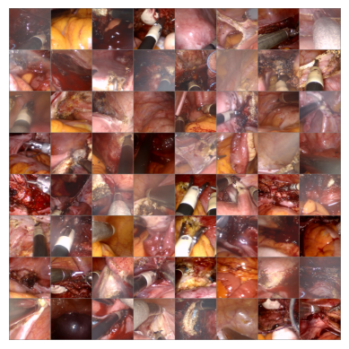
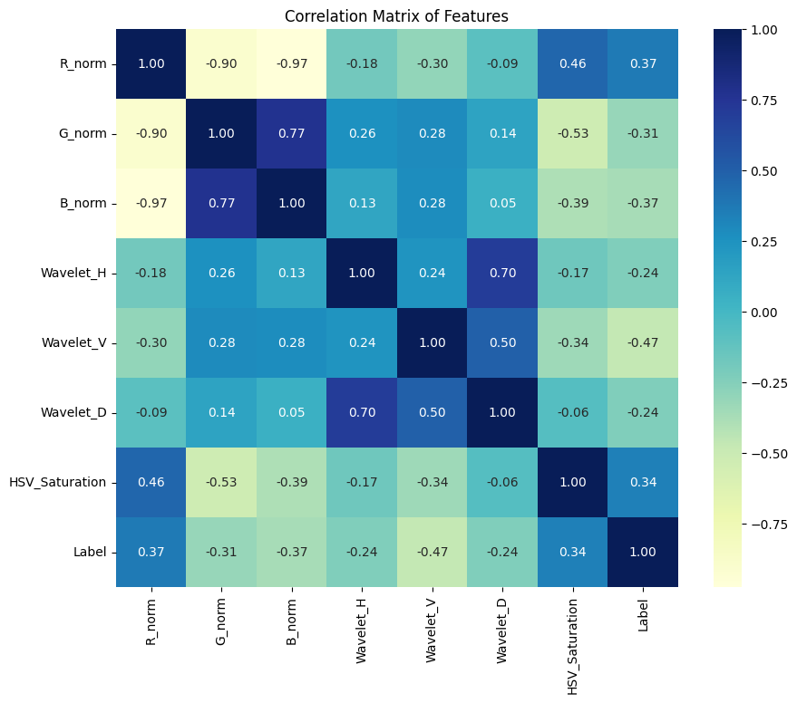
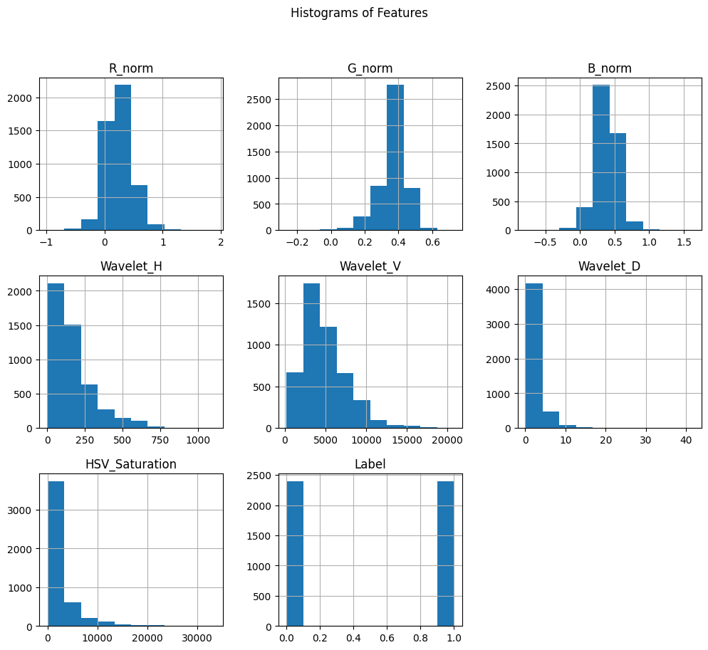
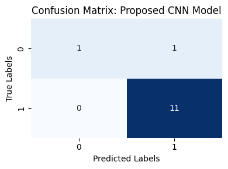
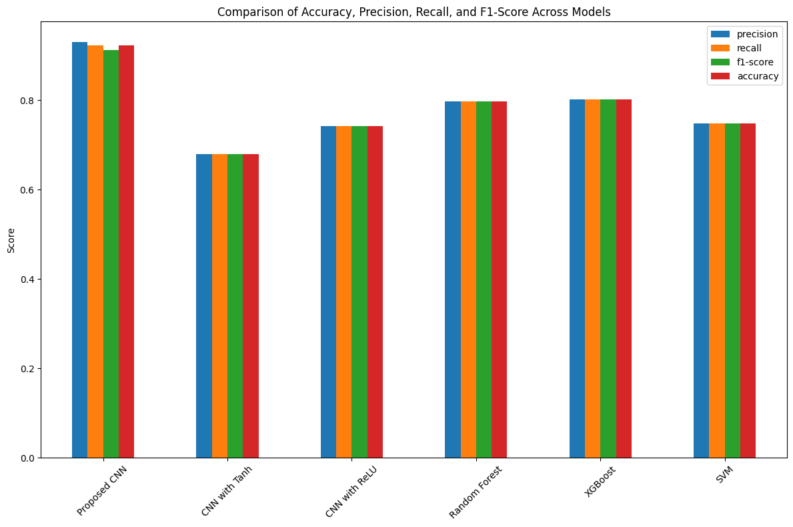

# 🚑 Laparoscopic Smoke Detection using Convolutional Neural Networks  

  

## 📌 Overview  
This repository contains the implementation of a **Convolutional Neural Network (CNN)-based model for detecting smoke in laparoscopic images**. The model integrates **multi-modal feature fusion** by combining spatial image data with extracted numerical features such as:  

✅ **Normalized-RGB** (chromatic information)  
✅ **Wavelet energy** (smoke sharpness reduction)  
✅ **GLCM texture** (texture variation analysis)  
✅ **HSV color space** (desaturated smoke pixels)  
✅ **Optical flow** (smoke motion tracking)  
✅ **Fog Area** (accumulated smoke detection)  

The proposed method enhances real-time surgical visibility by accurately detecting smoke obstructions in laparoscopic video frames.  

---

## 📊 Features  
✔️ **Real-time smoke detection** in laparoscopic videos  
✔️ **Multi-modal feature extraction** for improved accuracy  
✔️ **Optimized CNN architecture** for efficient processing  
✔️ **Preprocessing techniques** (e.g., normalization for lighting variations)  
✔️ **Comparative analysis** with machine learning models (Random Forest, XGBoost, SVM)  

---

## 📝 Dataset  

The dataset consists of **frames extracted from 10 robot-assisted laparoscopic hysterectomy procedure videos** obtained from the **EPSRC Centre for Interventional and Surgical Sciences**.  

📌 **Key Information:**  
- Frames extracted at **1 FPS**  
- **300 hazy images** and **300 clear images** manually selected  
- Features extracted to aid in classification  

---

## 🔄 Methodology  

### **1️⃣ Preprocessing**  
- Frames are extracted at **1 FPS** from laparoscopic videos  
- **Image normalization** is applied to standardize brightness and contrast  

**🔹 Before Normalization**  
  

**🔹 After Normalization**  
  

### **2️⃣ Feature Extraction**  
- **Normalized-RGB**: Captures chromatic information  
- **Wavelet Energy**: Detects sharpness reduction due to smoke  
- **GLCM Texture**: Analyzes texture variations  
- **HSV Color Space**: Identifies desaturated smoke pixels  
- **Optical Flow**: Tracks smoke motion patterns  
- **Fog Area**: Detects accumulated smoke covering the scene  

**🔹 Feature Correlation Matrix**  
  

**🔹 Feature Histograms**  
  

### **3️⃣ Model Architecture**  
- **Convolutional layers** extract spatial patterns  
- **Fully connected layers** integrate CNN features with extracted numerical features  
- **Sigmoid activation** for binary classification (Smoke / No Smoke)  

📌 **Architecture Diagram:**  
  

### **4️⃣ Training and Evaluation**  
- Model trained using **Adam optimizer** with **binary cross-entropy loss**  
- Performance metrics: **Accuracy, Precision, Recall, F1-score**  
- Comparison with **Random Forest, XGBoost, SVM, and alternative CNN variants**  

---

## 🏆 Results  

The **proposed CNN model** achieves **92.6% accuracy**, outperforming existing models:  

| Model                   | Precision | Recall | F1-Score | Accuracy |
|-------------------------|-----------|--------|----------|----------|
| **Proposed CNN**        | **0.93**  | **0.92** | **0.91** | **0.92** |
| CNN with ReLU          | 0.74      | 0.74   | 0.74     | 0.74     |
| CNN with Tanh          | 0.68      | 0.68   | 0.68     | 0.68     |
| Random Forest          | 0.80      | 0.80   | 0.80     | 0.80     |
| XGBoost                | 0.80      | 0.80   | 0.80     | 0.80     |
| SVM                    | 0.75      | 0.75   | 0.75     | 0.75     |

**🔹 Confusion Matrix**  
  

**🔹 Model Performance Comparison**  
  

---

### Installation

1. Clone the Repository
   
git clone https://github.com/nancy280/Smoke-Detection-in-Laproscopic-Surgery.git
cd Laparoscopic-Smoke-Detection

2. Install Dependencies
   
pip install -r requirements.txt

3. Run the Model

To train the model:
python train.py

To evaluate on test data:
python evaluate.py

4. Inference on New Data

To perform smoke detection on a new laparoscopic video:
python predict.py --input path/to/video.mp4

### Results
The proposed CNN achieves 92.6% accuracy, outperforming existing models

### Visualization
Feature Distributions
Correlation Matrix shows relationships between extracted features.
Histograms & Pair Plots highlight class separability.
Confusion Matrix provides a breakdown of classification results.

